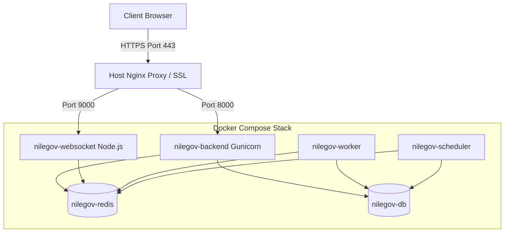

# NileGov Stack Deployment Playbook (Single-Node Prototype)

This playbook outlines the deployment architecture, configuration steps, and maintenance procedures for running the **NileGov Stack** on a basic, lean single-node Hetzner cloud server.

---

## Deployment Posture & Disclaimer

> [!IMPORTANT]
> **Deployment Status Disclaimer:**
> The prototype is deployed on a basic Hetzner server for demonstration and technical evaluation. Production deployment for an MDA (Ministry, Department, or Agency) would require sizing, security review, approved hosting, backup policy, monitoring, disaster recovery and formal Government onboarding.

### Four-Tier Infrastructure Progression
To ensure scaling security and sovereignty, the system is designed to transition smoothly through these four stages:
1. **Basic Hetzner Server (Current):** Prototype demonstration, technical evaluation, low-resource environment.
2. **Larger Hetzner or Private Cloud:** Extended pilot phase (allocated resources, performance benchmarks).
3. **Approved Government Hosting:** Sovereign production MDA deployment on national data center infrastructure.
4. **Hardened Production Clustering:** Replicated storage, high availability, separate database layer, and active disaster recovery sites.

---

## Technical Architecture Overview

The single-node prototype uses a host-level Nginx server to handle incoming HTTPS requests and route them to containerized microservices managed via Docker Compose.



### Resource Optimizations for Low Memory
* **Consolidated Redis Container:** A single Redis instance is used with three database indices (`1` for Cache, `2` for Queue, and `3` for SocketIO). This eliminates the system memory overhead of running multiple Redis daemon containers.
* **Unified Background Worker Container:** A single worker container runs `bench worker --queue short,default,long` instead of running three separate Python worker processes, saving ~400MB of RAM.
* **Tuned DB Engine:** InnoDB buffer pools and maximum connections in `mariadb.cnf` are clamped to prevent MariaDB from growing unbounded.
* **Host SSL Termination:** Running Nginx on the host avoids containerized network proxies, saving resources and simplifying Let's Encrypt certificate renewals.

---

## Future Migration Path (Clustering & Scaling)

The application code is decoupled from host infrastructure. Moving the stack from this single-node server to a highly available government production cloud does not require rewriting the application:

1. **Database Migration:**
   * Dump database using `./scripts/backup.sh`.
   * Provision a managed database cluster (e.g., AWS RDS MariaDB, Google Cloud SQL, or a dedicated, replicated MariaDB cluster on private VMs).
   * Update the `db_host` and `db_password` variables in `sites/common_site_config.json` inside the sites volume to point to the new cluster.
2. **Redis Migration:**
   * Provision a managed Redis service (e.g., AWS ElastiCache, Google Cloud Memorystore) or a standalone Redis cluster.
   * Update the connection strings in `common_site_config.json` (`redis_cache`, `redis_queue`, `redis_socketio`) to point to the new host.
3. **Storage Migration (S3 / Object Storage):**
   * Configure Frappe to use S3-compatible Object Storage for files (attachments and assets).
   * Enter the API keys and bucket endpoint details directly in Frappe Desk (`S3 Backup Settings` or by editing `common_site_config.json`), making local storage volumes redundant.
4. **App Container Scaling (Orchestration):**
   * Transition the Gunicorn and Worker containers to Kubernetes (using the official Frappe Helm charts) or AWS ECS.
   * Add a Load Balancer (e.g., AWS ALB, Nginx, HAProxy) in front of the scaled Gunicorn containers.
   * Set up HPA (Horizontal Pod Autoscaling) to automatically scale workers and web instances during high-traffic government operations.

---

## Step-by-Step Deployment Guide

### Prerequisites
* A Hetzner cloud server (e.g., CPX11 or CPX21 instance) running **Ubuntu 22.04 or 24.04 LTS**.
* SSH access with a private key.
* A registered domain pointing to the server IP.

### Step 1: Provision and Harden Host
Log into your server as `root` and run the host-setup script:
```bash
wget -O setup-host.sh https://raw.githubusercontent.com/.../deployment/scripts/setup-host.sh
chmod +x setup-host.sh
sudo ./setup-host.sh
```
This script will:
* Set up a `2GB` swap file.
* Create the `nilegov` deploy user and copy your SSH keys.
* Hardens SSH: Disables password login, disables root login.
* Activates UFW firewall: allows only SSH, Port 80, and Port 443.
* Sets kernel params: `vm.overcommit_memory = 1` and `swappiness = 10`.
* Installs Docker Engine, Docker Compose, Nginx, and Certbot.
* Configures Docker container log rotation limits (10MB max).

### Step 2: Switch to Deploy User and Clone Code
Log in as the newly created deploy user:
```bash
ssh nilegov@<server-ip>
```
Clone the NileGov repository and enter the deployment folder:
```bash
git clone <repo-url> nilegov
cd nilegov/deployment
```

### Step 3: Configure Environment Variables
Rename the template `.env.example` file and configure secure passwords:
```bash
cp .env.example .env
nano .env
```
*Modify `SITE_NAME` (e.g., `nilegov.gov.eg`), `DB_ROOT_PASSWORD`, `DB_PASSWORD`, and `ADMIN_PASSWORD`.*

### Step 4: Deploy the Orchestration Stack
Launch the containers in detached mode:
```bash
docker compose up -d
```
Verify all containers are active:
```bash
docker compose ps
```

### Step 5: Initial Site Provisioning
Wait for the database container to report healthy, then initialize the application site:
```bash
# Set up site config values
docker compose exec backend bench new-site nilegov.yourdomain.com \
  --db-name nilegov_db \
  --mariadb-root-username root \
  --mariadb-root-password <DB_ROOT_PASSWORD_FROM_ENV> \
  --admin-password <ADMIN_PASSWORD_FROM_ENV> \
  --install-app erpnext \
  --no-mariadb-socket
```
*Replace `nilegov.yourdomain.com` with your exact configured site domain.*

### Step 6: Configure HTTPS Proxy
1. Copy the proxy configuration into Nginx:
   ```bash
   sudo cp config/nginx.conf /etc/nginx/sites-available/nilegov
   ```
2. Edit the server names to match your domain:
   ```bash
   sudo nano /etc/nginx/sites-available/nilegov
   # Find server_name and change it to nilegov.yourdomain.com
   ```
3. Enable the site and restart Nginx:
   ```bash
   sudo ln -s /etc/nginx/sites-available/nilegov /etc/nginx/sites-enabled/
   sudo systemctl restart nginx
   ```
4. Obtain Let's Encrypt SSL certificates automatically:
   ```bash
   sudo certbot --nginx -d nilegov.yourdomain.com
   ```

---

## Operations & Maintenance

### 1. Automated Backups
The backup script (`deployment/scripts/backup.sh`) dumps the database, packages uploads, and encrypts the output using GPG symmetric encryption.

To schedule the script to run daily at 2:00 AM, configure crontab:
```bash
crontab -e
```
Add the following line:
```cron
0 2 * * * /home/nilegov/nilegov/deployment/scripts/backup.sh >> /var/log/nilegov_cron_backup.log 2>&1
```

### 2. Full Restoration / Disaster Recovery
If you need to recover the system on a new host:
1. Provision the host (Step 1) and launch the containers (Steps 2-4).
2. Execute the restore script with the encrypted backup file path:
   ```bash
   ./scripts/restore.sh /var/backups/nilegov/nilegov_backup_YYYYMMDD_HHMMSS.tar.gpg
   ```
3. Enter the GPG key and confirm with `y`. The script will decrypt files, restore the MariaDB schema, copy files back into the volumes, and run the `bench migrate` updates automatically.

### 3. Monitoring Uptime and Health
The health check script (`deployment/scripts/healthcheck.sh`) verifies container states, system memory, disk space, and application endpoints.

Schedule it via cron to run every 5 minutes:
```cron
*/5 * * * * /home/nilegov/nilegov/deployment/scripts/healthcheck.sh > /dev/null 2>&1
```
Check diagnostic logs at: `/var/log/nilegov_healthcheck.log`.
