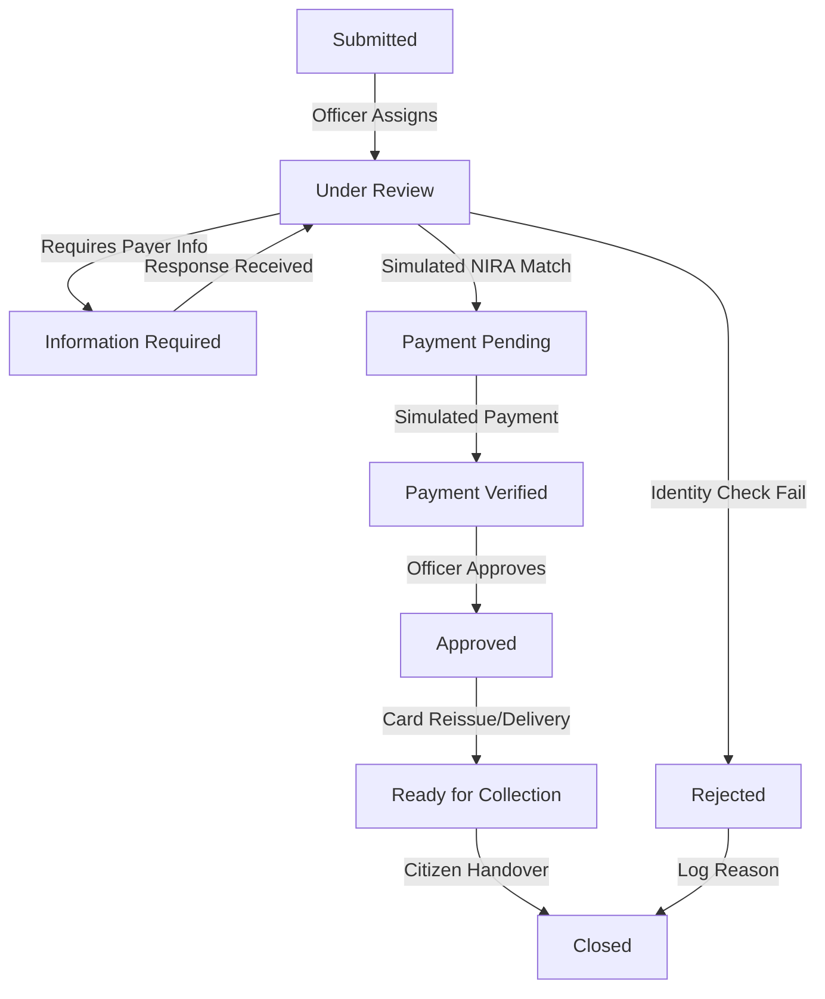
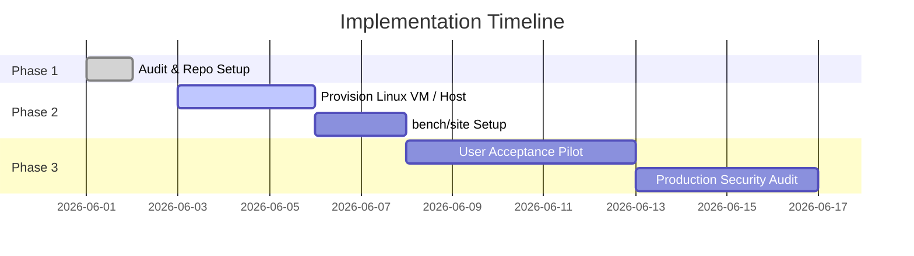

# NileGov Stack System Description

This document provides a comprehensive five-page overview of the **NileGov Stack** prototype, detailing the problem space, workflow design, technical architecture, security model, and implementation roadmap.

---

## Page 1: Executive Summary and Problem

### What NileGov Stack Is
The **NileGov Stack** is a modular, lightweight workflow and service-delivery platform designed specifically for Ministries, Departments, and Agencies (MDAs). By providing a reusable core of identity checks, status mapping, workflow transitions, and audit logging, NileGov Stack allows MDAs to rapidly digitize manual paper-based processes without needing complex, high-risk custom software builds.

### Why Government Service Workflows Need Digitization
Many citizen-facing public services in developing administrations remain paper-intensive, siloed, and slow. Document processing requires manual handover across desks, causing significant processing delays, lack of transparency for the citizen, and poor internal accountability. Additionally, tracking Service Level Agreements (SLAs) and monitoring queue bottlenecks is virtually impossible without unified digital logging.

### Why the Lost National ID Replacement Scenario Matters
Replacing a lost National Identification Card is a critical high-volume service that interacts with national security, citizen identity registry records, and public fee compliance. In a manual setup:
1. Citizens face long travel times to report losses and track statuses.
2. Officers must manually cross-reference records across internal registers.
3. Supervisor approvals and collection handovers are prone to delays and tracking errors.
4. Fee payments must be verified, introducing security risks.

The Lost National ID Replacement service serves as the ideal benchmark prototype to demonstrate how NileGov Stack streamlines intake, verification, tracking, and closure under strict SLA boundaries.

---

## Page 2: Solution Overview

### Core Solution Architecture
The NileGov Stack provides a digital case-management pipeline for service requests. It consists of the following components:
1. **Citizen Request Intake:** Capture of citizen PII, NIN, location context (e.g., Ntinda, Kampala), reason for request, police reference number, and legal consent.
2. **Officer Workflow:** An automated queue system that assigns cases to service desk officers, tracking case movements through a structured lifecycle.
3. **Status Lifecycle:** A state machine enforcing 9 distinct workflow statuses:
   `Submitted` → `Under Review` → `Information Required` → `Payment Pending` → `Payment Verified` → `Approved` → `Ready for Collection` → `Closed` (or `Rejected` → `Closed`).
4. **Simulated NIRA Verification:** A mock integration checkpoint that simulates querying the National Identification & Registration Authority registry to match NIN details.
5. **Simulated Payment Verification:** A mock integration checkpoint simulating payment confirmation via national tax or mobile money gateways.
6. **SLA Tracking:** Dynamic tracking of response and resolution milestones against configured hourly limits, exposing visual overdue alerts.
7. **Audit Trail:** An append-only log capturing all status updates, officer comments, and integration results.
8. **Dashboard Metrics:** Real-time calculation of key operations performance metrics, including total submissions, status counts, and SLA breaches.

---

## Page 3: Prototype Workflow and Use Case

### The Ntinda, Kampala Scenario
The prototype demonstrates a replacement request submitted by a citizen residing in Ntinda, Kampala. The service journey proceeds as follows:



### Step-by-Step Service Journey
1. **Intake (`Submitted`):** Citizen submits the request, generating a unique ID and reference number matching `NGS-NIRA-2026-XXXX`.
2. **Officer Review (`Under Review`):** The request enters the officer queue. The officer starts review and triggers the **Simulated NIRA Identity Verification**.
3. **Registry Check:** The system queries a simulated NIRA gateway, returning a matching verification timestamp and status, saving it locally.
4. **Fee Compliance (`Payment Pending`):** Once identity is matched, the case transitions to pending payment. The system triggers the **Simulated Payment Verification** to match tax reference logs.
5. **Verification & Approval (`Approved`):** The payment is verified, moving the status to approved.
6. **Delivery & Handover (`Ready for Collection` / `Closed`):** The replacement card is printed, flagged as ready, and eventually marked as closed upon citizen pickup.

---

## Page 4: Technical Architecture, Security and Scalability

### Framework Foundation
The NileGov Stack is built on top of the **Frappe Framework**, leveraging its rapid schema construction, Gunicorn Web servers, and MariaDB database storage.

```text
+-------------------------------------------------------------+
|                        Frappe Desk UI                       |
+-------------------------------------------------------------+
|             Client JS Custom Buttons / Actions              |
+-------------------------------------------------------------+
|              Frappe DocType Python Controller               |
+-------------------------------------------------------------+
|  Frappe Repository  |  Simulated Gateway  |  Pure-Python    |
|       Adapter       |     Integrations    |  Domain Logic   |
+---------------------+---------------------+-----------------+
|                       MariaDB Database                      |
+-------------------------------------------------------------+
```

### Decoupled Core Logic
The system enforces a clean architecture separation:
* **Pure Python Domain Layer:** Houses state machines, aggregates (e.g., `ServiceRequest`), value objects, and domain events. It is completely independent of the Frappe database ORM.
* **Infrastructure Layer:** Implements persistence adapters (such as `FrappeServiceRequestRepository`) mapping domain models to MariaDB records, along with simulated integrations.
* **REST/API Ready:** Endpoint integrations are designed as pluggable services, easing transition to live government service buses.

### Role-Based Access Control (RBAC) & Event Audit
Row-level permissions are scaffolded via Python hooks:
* Citizens only access their own submissions.
* Officers only access assigned queue records.
* Supervisors view escalations.
* Audit trail events are immutable and read-only.

---

## Page 5: Local Innovation Value and Implementation Roadmap

### Ugandan GovTech Relevance
By utilizing standard Python and web frameworks, NileGov Stack allows local developers and engineers to customize workflows without requiring expensive proprietary platforms. This reduces ongoing licensing costs and vendor lock-in for Ugandan public agencies.

### Pilot Readiness
The prototype codebase is fully unit-tested (118 tests passing 100% green) and Gunicorn-ready. Once deployed on a working container host, it is ready to be piloted for user interface verification.

### Next Implementation Steps

