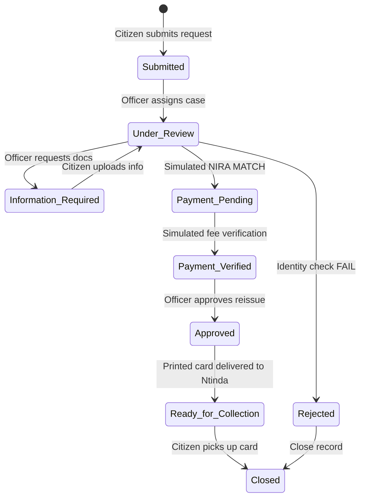

# NileGov Stack Workflow Diagram Brief

This document defines the lifecycle states, checkpoints, and transition conditions for the Lost National ID Replacement service workflow. It serves as a visual guide and layout instruction brief for a designer to create a clear workflow diagram.

---

## 1. Lifecycle State Pipeline

The core pipeline is a sequence of **9 statuses** tracking a replacement request from creation to final pickup:

---

## 2. Checkpoints and Action Metadata

For each transition state, the diagram should visually display the corresponding actor, check system, and background updates:

### Phase A: Submission & Intake
* **State:** `Submitted`
  - **Actor:** Citizen (residing in Ntinda, Kampala).
  - **Trigger:** Submits lost ID details, police reference number, and legal consent.
  - **Audit Checkpoint:** System fires `RequestSubmitted` domain event and inserts immutable entry in `NileGov Audit Event` table.
  - **SLA Checkpoint:** Calculates and stores the 24-hour response deadline.
  - **Dashboard Metrics:** Increments `Total Submissions` counter.

### Phase B: Review & Registry Validation
* **Transition:** `Submitted` → `Under Review`
  - **Actor:** Service Desk Officer (assigned user).
  - **Trigger:** Officer opens the case queue.
  - **Simulated NIRA Checkpoint:** Officer clicks **Trigger Simulated NIRA Verification**. Mock API verifies the NIN, returning match metadata. An entry is created in the integration simulation log with the mock disclaimer.
* **Alternate Transition:** `Under Review` → `Information Required`
  - **Actor:** Officer.
  - **Trigger:** Case note added requesting additional document uploads. SLA response timer is suspended.

### Phase C: Fee Verification
* **Transition:** `Under Review` (Matched status) → `Payment Pending`
  - **Actor:** System / Officer.
  - **Trigger:** Identity match triggers transition to pending payment.
* **Transition:** `Payment Pending` → `Payment Verified`
  - **Actor:** System / Mock Payment gateway.
  - **Trigger:** Officer clicks **Trigger Simulated Payment Verification**, matching simulated mobile money or tax reference IDs.

### Phase D: Reissue & Collection
* **Transition:** `Payment Verified` → `Approved`
  - **Actor:** Officer.
  - **Trigger:** Final check approved for printing.
* **Transition:** `Approved` → `Ready for Collection`
  - **Actor:** Liaison Desk Officer.
  - **Trigger:** Replacements printed and shipped to Ntinda collection office. SLA resolution timer stops.
* **Transition:** `Ready for Collection` → `Closed`
  - **Actor:** Citizen / Liaison Officer.
  - **Trigger:** Physical card handed over; citizen signs confirmation; officer enters mandatory closure notes and saves.
