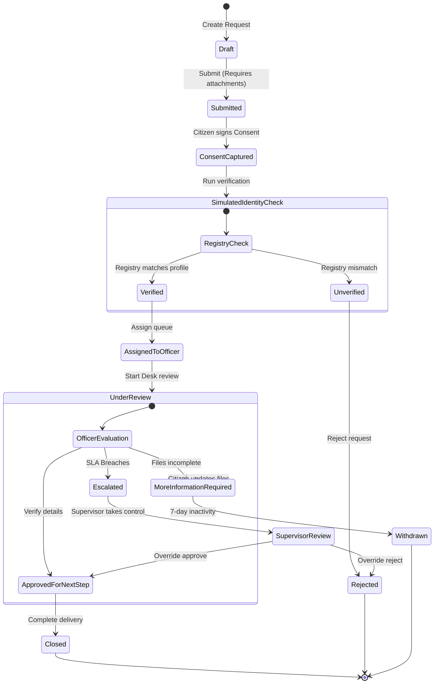

# NileGov Stack Workflow & Case Lifecycle

This document defines the lifecycle states and validation sequences for a citizen's service request, visualizing the progression from initial intake draft to final resolution or rejection.

---

## Workflow Flowchart

---

## Step-by-Step State Explanations

### 1. Draft
* **Actor:** Citizen
* **Triggers:** Citizen opens portal and initiates a service request (e.g. Lost ID Replacement).
* **Validation:** No fields are locked; editing allowed.

### 2. Submitted
* **Actor:** Citizen / System
* **Triggers:** Citizen uploads required attachments (e.g., Police Report) and triggers submission.
* **Validation:** System checks that mandatory inputs exist. Transition block prevents bypassing attachments.

### 3. Consent Captured
* **Actor:** Citizen
* **Triggers:** Citizen accepts the legal terms, capturing a digital signature/hash log.
* **Validation:** Capture IP address and timestamp. Prevents proceeding to external simulation checks without citizen permission.

### 4. Simulated Identity Check
* **Actor:** System (Registry Integration)
* **Triggers:** Capture of consent triggers a simulated query to NIRA.
* **Validation:** If NIN is found and first/last name matches, state transitions to `Simulated Identity Check`. If mismatch, state transitions to `Rejected`.

### 5. Assigned to Officer
* **Actor:** System (Scheduler)
* **Triggers:** Successful identity check schedules allocation.
* **Validation:** Case is routed to the active queue of the least-busy Case Officer.

### 6. Under Review
* **Actor:** Service Desk Officer
* **Triggers:** Officer opens the assigned request and clicks "Start Review".
* **Validation:** Instantly calculates the **SLA Deadline** based on service parameters. Locks editing for the citizen and other officers.

### 7. More Information Required
* **Actor:** Service Desk Officer
* **Triggers:** Officer rejects an attachment (e.g., Police report text is blurry) and adds a query.
* **Validation:** Unlocks file upload fields for the citizen portal, sends an alert, and pauses SLA timers.

### 8. Escalated
* **Actor:** System (Cron Health check)
* **Triggers:** System detects that a request has been in `Under Review` status past the calculated `sla_deadline`.
* **Validation:** Triggers a `SLABreached` domain event, writes to audit logs, and routes the case to the Supervisor queue.

### 9. Supervisor Review
* **Actor:** Supervisor
* **Triggers:** Supervisor signs in and opens the escalated case file.
* **Validation:** Supervisor can override assignments, redirect files to desk officers, or approve/reject the request.

### 10. Approved for Next Step
* **Actor:** Officer / Supervisor
* **Triggers:** Reviewer completes verification and authorizes request completion.
* **Validation:** Generates a tamper-evident audit signature.

### 11. Closed (Terminal)
* **Actor:** System / Officer
* **Triggers:** Document printing or service delivery confirmation is logged.
* **Validation:** Generates final resolved status logs, sends notification to citizen.
